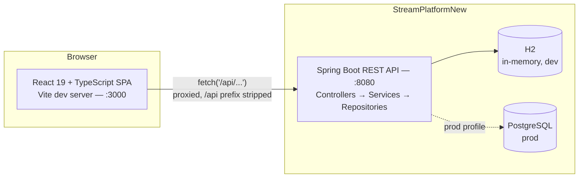

# StreamPlatform

A full-stack, Netflix-style streaming catalog: a React + TypeScript single-page app backed by a Spring Boot REST API. Browse a movie catalog organized by genre, and build personal watchlists you can create, rename, and curate on the fly.


---

## Overview

StreamPlatform is a two-part project that pairs a modern React frontend with a Spring Boot backend to explore what a real streaming service's core browsing and list-management experience looks like end to end:

- **`FrontForStreamPlatform/`** — a React 19 + TypeScript SPA (Vite, Tailwind CSS 4) that renders the catalog, a hero landing page, and watchlist management.
- **`StreamPlatformNew/`** — a Spring Boot 4 REST API (Java 17, Spring Data JPA) that serves the movie catalog and persists custom watchlists, with H2 for local development and PostgreSQL for production.

## Features

- **Catalog browsing** — a responsive movie grid with poster fallbacks (auto-generated initials when no artwork is available) and genre-based grouping (Drama, Sci-Fi, Comedy, Horror, Adventure).
- **Landing page** — a hero section with a "Trending now" row pulled straight from the catalog.
- **Personal watchlists ("My Lists")** — create, rename, and delete named lists, and save any movie to one or more lists directly from its card via a dropdown picker.
- **Responsive navigation** — a collapsible sidebar with a mobile-friendly slide-out menu.
- **Seeded sample data** — the backend seeds 20 sample movies across all five genres on first run, so the app is populated out of the box.
- **Containerized backend** — a multi-stage Dockerfile builds a slim, non-root JRE image for the API.

## Tech Stack

| Layer | Technology |
|---|---|
| Frontend | React 19, TypeScript, Vite, Tailwind CSS 4 |
| Backend | Java 17, Spring Boot 4.1, Spring Web MVC, Spring Data JPA |
| Database | H2 (in-memory, dev) / PostgreSQL (prod) |
| Tooling | Maven (with wrapper), oxlint, Docker |

## Architecture



In development, Vite's dev server proxies any request to `/api/*` through to the Spring Boot API on port 8080, stripping the `/api` prefix along the way — see [`vite.config.ts`](FrontForStreamPlatform/vite.config.ts).

## Project Structure

```
StreamPlatform/
├── FrontForStreamPlatform/          # React + TypeScript + Tailwind CSS frontend (Vite)
│   ├── src/
│   │   ├── Home/                    # Landing page: hero banner + trending row
│   │   ├── Movies/                  # Catalog grid, movie card, "save to list" picker
│   │   ├── MyList/                  # Watchlist management UI
│   │   ├── Sidebar/                 # Responsive navigation
│   │   ├── lib/                     # Data-fetching hooks (useMovies, useLists)
│   │   └── types.ts                 # Shared Movie type + helpers
│   └── vite.config.ts               # Dev server + /api proxy to the backend
│
├── StreamPlatformNew/                # Spring Boot REST API (Java 17)
│   ├── src/main/java/org/example/streamplatformnew/
│   │   ├── controllers/              # MovieController, CustomListController
│   │   ├── services/                 # Business logic
│   │   ├── models/                   # JPA entities — Movie, CustomList, Category
│   │   ├── repositroies/             # Spring Data JPA repositories
│   │   └── config/DataInitializer.java  # Seeds sample movies on startup
│   ├── src/main/resources/application.properties
│   └── Dockerfile                    # Multi-stage build: Maven → JRE Alpine
│
├── start.ps1                         # Launches backend + frontend together
└── start.cmd                         # cmd.exe / double-click wrapper for start.ps1
```

## Getting Started

### Prerequisites

- **Node.js 18+** and npm (frontend)
- **Java 17** (backend)
- Maven is not required globally — the project ships the Maven Wrapper (`mvnw` / `mvnw.cmd`)

### Quick start — run everything at once

From the repository root:

```powershell
.\start.ps1          # or: start.cmd  (from cmd.exe, or double-click it)
```

[`start.ps1`](start.ps1) launches both halves in their own windows, waits for each port to
come up, and prints the URLs. Ctrl+C in the launcher window stops everything.

| Flag | Effect |
|---|---|
| `-BackendOnly` | Start only the Spring Boot API |
| `-FrontendOnly` | Start only the Vite dev server (API assumed to be running already) |
| `-SkipInstall` | Skip the automatic `npm install` when `node_modules` is missing |

It skips whichever service already has its port occupied, so re-running it alongside a
service you started by hand is safe. On macOS/Linux, use the manual steps below.

### Manual start

#### 1. Run the backend

```bash
cd StreamPlatformNew
./mvnw spring-boot:run        # Windows: mvnw.cmd spring-boot:run
```

The API starts on **http://localhost:8080**, using an in-memory H2 database by default, and automatically seeds 20 sample movies across all five genres on first boot.

#### 2. Run the frontend

```bash
cd FrontForStreamPlatform
npm install
npm run dev
```

The app opens on **http://localhost:3000**. With the backend running, the catalog and watchlists populate automatically through the built-in `/api` proxy.

### Backend via Docker

```bash
cd StreamPlatformNew
docker build -t streamplatform-api .
docker run -p 8080:8080 streamplatform-api
```

## API Reference

### Movies — `/movies`

| Method | Endpoint | Description |
|---|---|---|
| GET | `/movies` | List every movie in the catalog |
| GET | `/movies/categories` | All movies grouped by category |
| GET | `/movies/{movieName}` | Look up a single movie by name |
| GET | `/movies/{category}` | Filter movies by genre (`DRAMA`, `SCI_FI`, `COMEDY`, `HORROR`, `ADVENTURE`) |

### Watchlists — `/lists`

| Method | Endpoint | Description |
|---|---|---|
| GET | `/lists` | List every custom watchlist |
| POST | `/lists/{name}/{description}` | Create a new watchlist |
| POST | `/lists/{listId}/movies/{movieId}` | Add a movie to a watchlist |
| DELETE | `/lists/{listId}/movie/{movieId}` | Remove a movie from a watchlist |

## Configuration

The backend is configured via [`application.properties`](StreamPlatformNew/src/main/resources/application.properties) and environment variables:

| Variable | Purpose | Default |
|---|---|---|
| `H2_CONSOLE_ENABLED` | Expose the H2 web console at `/h2-console` for local debugging | `false` |
| `JWT_SECRET` | Reserved for upcoming JWT-based authentication (not yet wired up) | *(none)* |

## Testing & Linting

```bash
# Backend — JUnit / Spring Boot Test
cd StreamPlatformNew && ./mvnw test

# Frontend — oxlint
cd FrontForStreamPlatform && npm run lint
```

## Roadmap

- [ ] Series/TV catalog (the UI tab is scaffolded; no backend endpoint yet)
- [ ] JWT-based authentication and per-user accounts
- [ ] Broader automated test coverage on both sides
- [ ] Frontend container image alongside the existing backend Dockerfile

## Author

Built by [Dan Sayag](https://github.com/danSayag).
